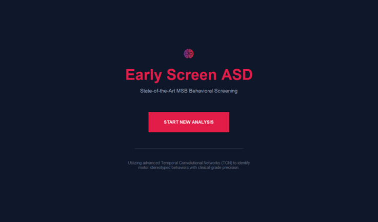

<div align="center">

# 🧠 EARLYSCREEN ASD

### AI-Powered Early Autism Spectrum Disorder Screening System

Detecting Autism-Related Behavioral Patterns using Computer Vision & Deep Learning


<br>


</div>

---

# 📖 About The Project

EARLYSCREEN ASD is an intelligent behavioral screening application designed to assist in the early identification of Autism Spectrum Disorder (ASD) using Artificial Intelligence and Computer Vision.

The application analyzes uploaded behavioral videos and detects repetitive motor stereotyped behaviors such as:

✅ Arm Flapping

✅ Head Banging

✅ Body Spinning

The system uses a hybrid deep learning architecture combining ResNet-18 and Temporal Convolutional Networks (TCN) to identify behavioral patterns over time and generate screening reports.

---

# ✨ Features

* 🎥 Behavioral Video Analysis
* 🧠 Deep Learning Powered Detection
* 📊 Confidence-Based Predictions
* 📄 Automated PDF Reports
* 🔒 Privacy-Focused Local Processing
* ⚡ Fast Offline Inference
* 👨‍⚕️ Clinical Screening Support

---

# 🏗️ System Workflow

```text
Video Upload
      ↓
Frame Extraction
      ↓
ResNet-18 Feature Extraction
      ↓
Temporal Sequence Buffer
      ↓
TCN Classification
      ↓
Voting & Confidence Analysis
      ↓
PDF Report Generation
      ↓
Screening Results
```

---

# 📸 Application Screenshots

## 🏠 Home Screen



---

## 🎥 Video Upload Interface


---

## ⚙️ Analysis Processing


---

## 📊 Results Dashboard


---

## 📄 Generated PDF Report


---

# 🧠 AI Architecture

## Spatial Feature Extraction

* ResNet-18 Backbone
* 512-Dimensional Embeddings
* Posture Analysis

## Temporal Modeling

* Temporal Convolutional Network (TCN)
* Sliding Window Inference
* Motion Pattern Recognition

## Behavioral Classes

| Class         | Description                    |
| ------------- | ------------------------------ |
| Arm Flapping  | Repetitive Arm Movements       |
| Head Banging  | Repetitive Head Impact Motions |
| Body Spinning | Rotational Body Movement       |

---

# 🏛️ System Architecture


---

# 📂 Project Structure

```text
EARLYSCREEN-ASD
│
├── desktop_app.py
├── report_generator.py
├── best_model.pkl
│
├── screenshots
│   ├── home.png
│   ├── upload.png
│   ├── analysis.png
│   ├── results.png
│   └── report.png
│
├── models
├── reports
├── assets
├── requirements.txt
└── README.md
```

---

# ⚙️ Installation

## Clone Repository

```bash
git clone https://github.com/ULS-sankar/Earlyscree-ASD.git

cd Earlyscree-ASD
```

## Install Dependencies

```bash
pip install -r requirements.txt
```

## Run Application

```bash
python desktop_app.py
```

---

# 📊 Dataset Information

* Total Videos: 75+
* Classes: 3
* Average Duration: 90 Seconds
* Real-World Behavioral Samples
* Public Research Dataset

---

# 🔐 Privacy & Security

EARLYSCREEN ASD follows an Edge-AI architecture.

✔ No Cloud Uploads

✔ Local Processing

✔ Offline Execution

✔ User-Controlled Data

✔ Enhanced Privacy Protection

---

# 🚀 Future Improvements

* Real-Time Webcam Detection
* Mobile Application Version
* Explainable AI Visualizations
* Multi-Language Support
* Healthcare Dashboard Integration
* Cloud Synchronization

---

# 👨‍💻 Author

### SASISANKAR U L

🎓 B.Tech Computer Science

🏫 Bharathidasan University

🌐 GitHub: https://github.com/ULS-sankar

📧 Email: [sasi2005sankar@gmail.com](mailto:sasi2005sankar@gmail.com)

---

<div align="center">

⭐ If you found this project useful, consider starring the repository.

</div>
